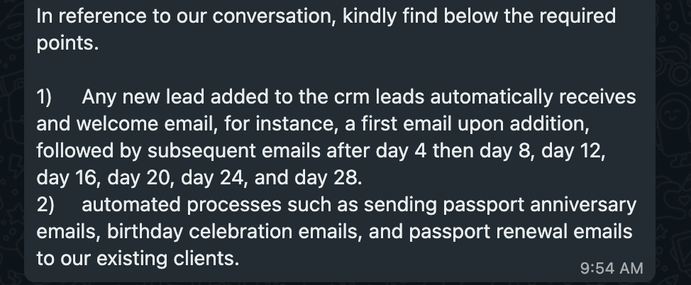
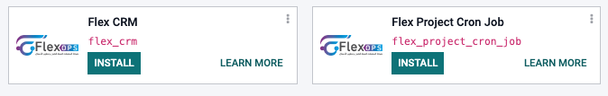
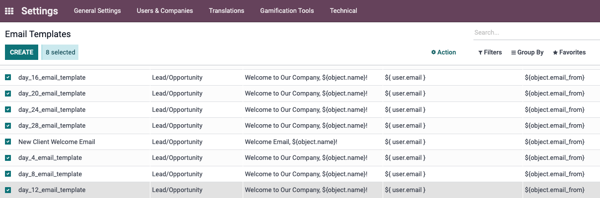
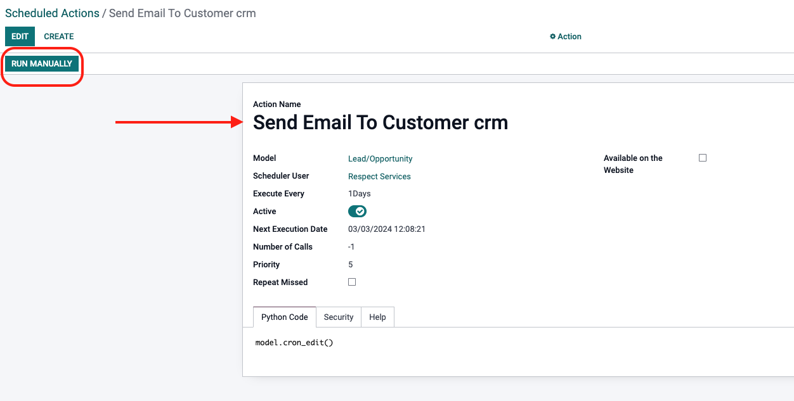
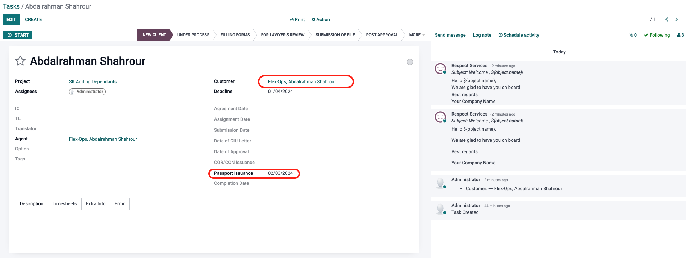
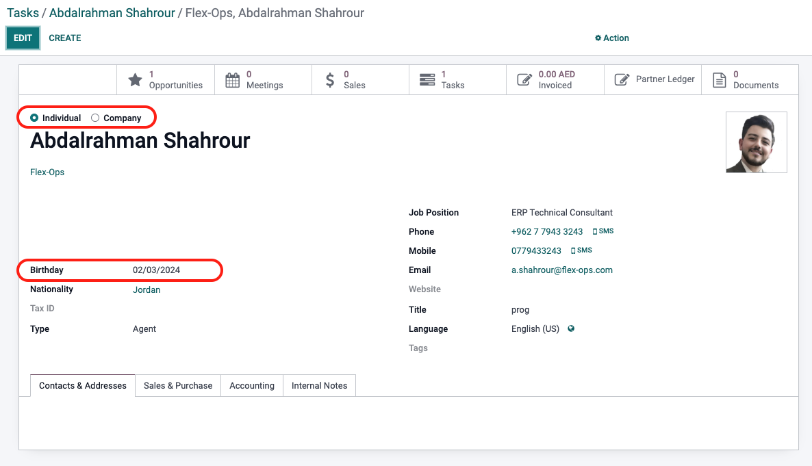
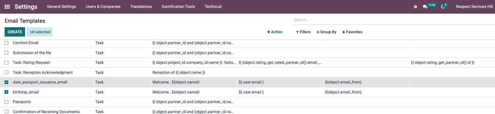
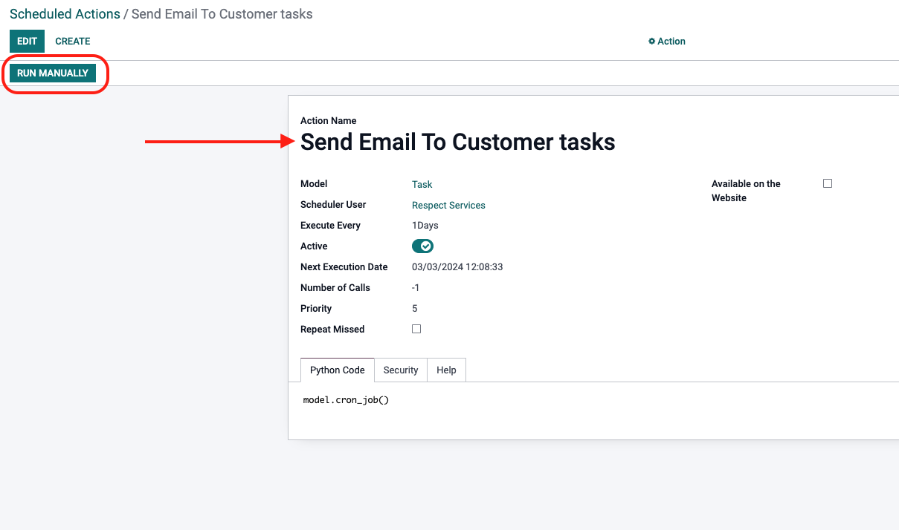

# Flex-ops

# Automation send email

## this document build for explain task automation send email - custom addons

The points of this document are:

- [x] [1. Introduction](#1-introduction)
- [x] [2. Requirements](#2-requirements)
- [x] [3. Installation](#3-installation)
- [x] [4. Configuration](#4-configuration)
- [x] [5. Usage](#5-usage)

## 1. Introduction

This document is a guide to install and configure the custom addons for the task automation send email.

1. `flex_crm` module for point one of the task.
2. `flex_project_cron_job` module for point two of the task.

## `flex_crm` module

`1)	Any new lead added to the crm leads automatically receives and welcome email, for instance, a first email upon addition, followed by subsequent emails after day 4 then day 8, day 12, day 16, day 20, day 24, and day 28.`

email will send when you create a new lead in the CRM module, and the email will send automatically after 4 days, 8 days, 12 days, 16 days, 20 days, 24 days, and 28 days.

we know that the lead has a field called `create_date` and we will use this field to calculate the days between the creation date and the current date.

### can you find the email templates in the system in the path `Settings -> Technical -> Email Templates`

Note: you can change the email template from the email template form

### can you find schedule action in the system in the path `Settings -> Technical -> Automation -> Scheduled Actions`

[

if u need test the action you can click on the `Run Manually` button and check the mails in `settings -> Technical -> massages`
or `odoo.sh -> mail` if you have from development team and have access to the odoo.sh

## `flex_project_cron_job` module

`2)	Any project that is created and has a start date and end date, automatically sends an email to the project manager 3 days before the start date, and 3 days before the end date.`

you must to fill the `Passport Issuance` Date and `Customer Name` fields in the project form

if the today is equal to the `Passport Issuance` Date in tasks project form, the system will send an email to the Customer

and if the today is birthday of the Customer, the system will send an email to the Customer

note : can you find the `Passport Issuance` Date in the tasks project form
and birthday of the Customer in the Customer form -> the birthday field is invisible if contact type is company

### can you find the email templates in the system in the path `Settings -> Technical -> Email Templates`

### can you find schedule action in the system in the path `Settings -> Technical -> Automation -> Scheduled Actions`

